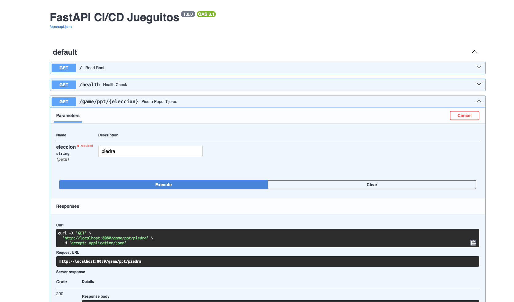
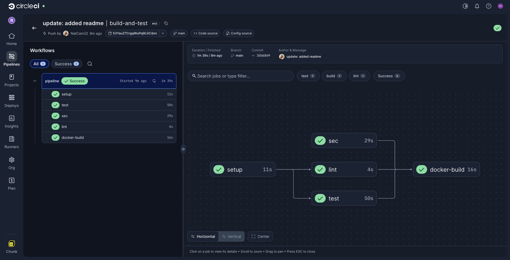
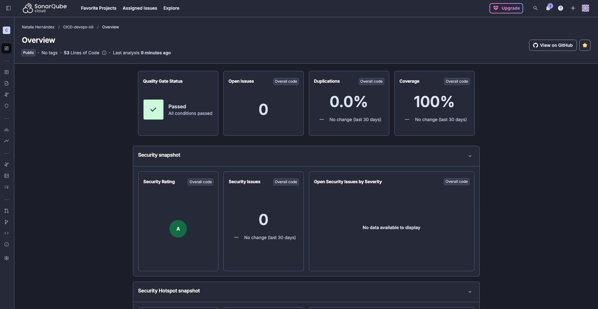
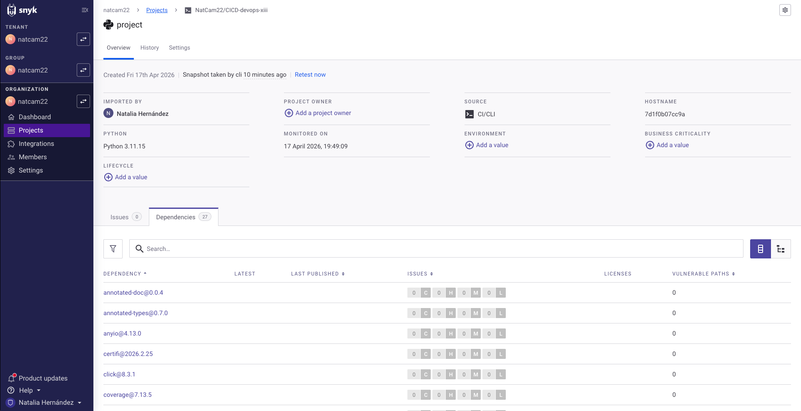

# FastAPI CI/CD Games

Pipeline completo de CI/CD para una aplicación FastAPI, "desplegada" en Kubernetes con ArgoCD.

## Enlaces

| Recurso | Enlace |
|---|---|
| Imagen en GHCR | `ghcr.io/natcam22/fastapi-cicd:latest` |
| Video explicativo | https://youtu.be/UtQEH74oz1k |

---

## Descripción

Aplicación web construida con **FastAPI** que expone tres juegos a través de una API REST:

- **Piedra, Papel o Tijeras** → `GET /game/ppt/{eleccion}`
- **Adivina el número** → `GET /game/number/start` y `GET /game/number/guess/{game_id}/{guess}`
- **Dados** → `GET /game/dice/{num_dice}`

La app incluye un endpoint de health check (`GET /health`) utilizado por las probes de Kubernetes.

---

## Stack Elegido

| Capa | Tecnología |
|---|---|
| Lenguaje | Python 3.11 |
| Framework | FastAPI |
| Tests | pytest + pytest-cov |
| Linting | flake8 |
| CI/CD | CircleCI |
| Análisis estático | SonarCloud |
| Análisis de vulnerabilidades | Snyk |
| Registro de imágenes | GitHub Container Registry (GHCR) |
| Orquestación | Kubernetes (Minikube) |
| Despliegue continuo | ArgoCD |

---

## Estructura del Proyecto

```
fastapi-cicd/
├── app/
│   ├── __init__.py
│   └── main.py               # Lógica de la aplicación
├── tests/
│   ├── __init__.py
│   └── test_main.py          # Tests con mocking
├── k8s/
│   ├── deployment.yaml       # Deployment de Kubernetes
│   ├── service.yaml          # Service de Kubernetes
│   └── ingress.yaml          # Ingress de Kubernetes
├── argocd/
│   └── application.yaml      # Configuración de ArgoCD
├── .circleci/
│   └── config.yml            # Pipeline de CircleCI
├── sonar-project.properties  # Configuración de SonarCloud
├── Dockerfile
├── .dockerignore
└── requirements.txt
```

---

## Pipeline de CI/CD

El pipeline está definido en `.circleci/config.yml` y se compone de los siguientes jobs:

### `setup`
- Restaura el cache de dependencias usando el checksum de `requirements.txt`
- Crea un virtualenv e instala las dependencias
- Guarda el cache y persiste el workspace para los jobs siguientes

### `test`
- Ejecuta los tests con `pytest`
- Genera informe de cobertura en `coverage.xml`
- Envía el análisis a SonarCloud
- Requiere: `setup`

### `lint`
- Ejecuta `flake8` sobre `app/` y `tests/`
- Requiere: `setup`

### `snyk`
- Escanea las dependencias en busca de vulnerabilidades conocidas
- Corre en paralelo desde el inicio (solo necesita `checkout`)

### `docker-build` (solo en `main`)
- Construye la imagen Docker
- La publica en GHCR con dos tags: `latest` y el SHA del commit
- Requiere: `test`, `lint`, `snyk`

---

## Variables de Entorno (CircleCI Contexts)

| Context | Variable | Descripción |
|---|---|---|
| `SonarCloud` | `SONAR_TOKEN` | Token de análisis de SonarCloud |
| `Snyk` | `SNYK_TOKEN` | Token de autenticación de Snyk |
| `GHCR` | `GHCR_TOKEN` | Personal Access Token de GitHub |
| `GHCR` | `GHCR_USER` | Usuario de GitHub en minúsculas |

---

## Kubernetes

Los manifiestos se encuentran en la carpeta `k8s/` y definen:

- **Deployment** con 2 réplicas, liveness probe y readiness probe sobre `/health`
- **Service** tipo ClusterIP expuesto en el puerto 80
- **Ingress** con nginx apuntando al host `fastapi.local`

### Despliegue local con Minikube

```bash
# Iniciar Minikube
minikube start

# Aplicar manifiestos manualmente
kubectl apply -f k8s/

# Añadir host local
echo "$(minikube ip) fastapi.local" | sudo tee -a /etc/hosts

# Iniciar tunnel
minikube tunnel
```

La app quedará disponible en `http://fastapi.local/docs`

---

## ArgoCD

ArgoCD está configurado para sincronizar automáticamente los manifiestos de la carpeta `k8s/` desde la rama `main`. Esta parte normalmente estaría en otro repo pero en este caso dado lo simple del proyecto y la unicidad del repo de entrega lo dejé todo en el mismo.

```bash
# Instalar ArgoCD con Helm
helm repo add argo https://argoproj.github.io/argo-helm
helm repo update
helm install argocd argo/argo-cd --namespace argocd --create-namespace

# Aplicar la configuración de la aplicación
kubectl apply -f argocd/argoapp.yaml

# Acceder a la UI
kubectl port-forward svc/argocd-server -n argocd 8080:443
```

La UI queda disponible en `https://localhost:8080`

---

## Git Flow

El proyecto utiliza git flow con las siguientes ramas:

| Rama | Propósito |
|---|---|
| `main` | Producción — dispara el build de Docker y el despliegue |
| `dev` | Integración — acumula features antes de la release |
| `ft<nombre-rama>` | Nuevas funcionalidades |
| `rl<nombre-rama>` | Preparación de releases |
| `fx<nombre-rama>` | Hotfixes urgentes sobre main |

---

## Correr Tests Localmente

```bash
pip install -r requirements.txt
pytest tests/ -v --cov=app --cov-report=term-missing
```

---

## Docker

```bash
# Build
docker build -t fastapi-cicd .

# Run
docker run -p 8000:8000 fastapi-cicd
```

La app queda disponible en `http://localhost:8000/docs`

---

## Screenshots





